# ChargeHub — Reservation Architecture v2 (Design)

**Status: DESIGN — not yet implemented.** This document specifies the revised reservation
architecture requested for operational maturity. No code has been written for it. Until a
piece ships and is verified, `CLAUDE.md` continues to describe the *current* system; this
file describes the *target*. Each section below is written so it can be implemented
additively, without breaking a single existing invariant.

> **Prime directive carried over from `CLAUDE.md`:** the conflict-free reservation
> guarantee is enforced by the database (partial unique index on `bookings.slotId`), not by
> application logic. Every new feature here is built *through that guarantee*, never around
> it. Where a new feature needs to hold time on a charger, it does so by claiming a real
> `slot` through the existing atomic claim — the same index keeps everything conflict-free.

---

## 0. What changes, in one paragraph

Today a reservation is a promise over a single 30-minute interval, and its life ends at
`completed`, `cancelled` or `no_show`. This revision adds the **operational reality between
arrival and departure**: drivers arrive late (grace + *At Risk*), stay longer (extensions),
leave early (staff-ended, capacity freed), or overstay (warning → escalation → staff alert).
It adds a **staff role** for on-site personnel, a **two-tier waitlist** (remote and on-site),
a **technical-incident** path with **delay propagation**, and the **analytics** those events
make possible. Structurally it introduces one new idea — a **time-driven Transition Engine**
(a clock) that advances reservations through time-triggered states — and finally wires the
**event → notification** path that `CLAUDE.md` notes is not yet built.

---

## 1. Design principles & invariant preservation

Every invariant in `CLAUDE.md` §2 is preserved. This table is the contract; if an
implementation would violate a row, stop and flag it.

| Invariant (current) | How v2 preserves it |
|---|---|
| Atomic, DB-enforced claim; partial unique index on `slotId` | Unchanged. **Extensions and waitlist acceptances claim real slots through the exact same path** — a second claimant is refused by the index, not by code. |
| Ownership scoped in the query | All new driver-owned reads (my waitlist entries, my sessions) use `findOne({ _id, userId })`. Staff/admin reads are gated by role + station scope, still in-query. |
| Validation/allowlist at the boundary (Zod) | Every new endpoint gets a Zod schema; the schema is the allowlist. No raw `Object.assign`. |
| Provider layer is sacred (vehicles only) | Untouched. The Transition Engine, waitlist and delay engine are **backend services**, not providers. |
| Money is estimated; no payments | **No fees anywhere in v2.** Overstay is handled operationally (escalation to staff), not financially. Late/overstay *penalties* remain future work gated on a real payment integration. |
| Charger `status` is operator-declared serviceability | Unchanged. Incidents set charger `maintenance`/`offline`; occupancy still lives on the interval, never on the charger. |
| `select:false` sensitive fields | New sensitive fields (e.g. walk-in contact phone) follow the same rule. |
| `requireAuth`/`requireAdmin` are async | New `requireStaff` guard is async and station-scoped, same pattern. |
| Client holds no DB access | The clock/worker is server-side; the client only calls the API. |
| Schema is additive-only; never rename | **Everything below is additive**: new enum *values*, new fields, new collections. No rename, no destructive change. |
| Assistant has no LLM | Analytics are aggregation queries, not generated text. Unchanged. |

**One net-new architectural element:** a **Transition Engine** (server-side clock). Several
required states — *At Risk*, *no-show*, overstay escalation, waitlist-offer expiry — are
triggered by *the passage of time*, not by a user action. The current system has no such
mechanism. It is introduced in §9.2 as an idempotent, conditionally-guarded sweep.

---

## 2. Domain model updates

### 2.1 Two concepts, cleanly separated

- **Reservation** = the promise to hold specific interval(s) on a charger for a driver.
  Stored in `bookings` (unchanged collection name). Remains the aggregate root.
- **Charging session** = the physical act of charging against a reservation, from **check-in**
  to **end**. In v2 the session is **not a new collection** — it is represented by fields on
  the anchor reservation (`checkInAt`, `endedAt`, `endedBy`, `endReason`, `overstayStage`)
  plus any **extension reservations** linked to it. See ADR-2 (§13) for why this beats a
  separate `sessions` collection: it keeps the slot↔reservation invariant exactly one-to-one
  and requires no new reconciliation.
- **Extension** = an additional 30-minute block claimed on the *same charger, immediately
  after* the current one. It is a **child reservation** (`isExtension = true`,
  `parentBookingId = anchor`) that claims the adjacent `slot` through the normal atomic claim.
  The "session end" is `max(endTime)` across the anchor and its live extensions.

### 2.2 Entity-relationship additions (additive)

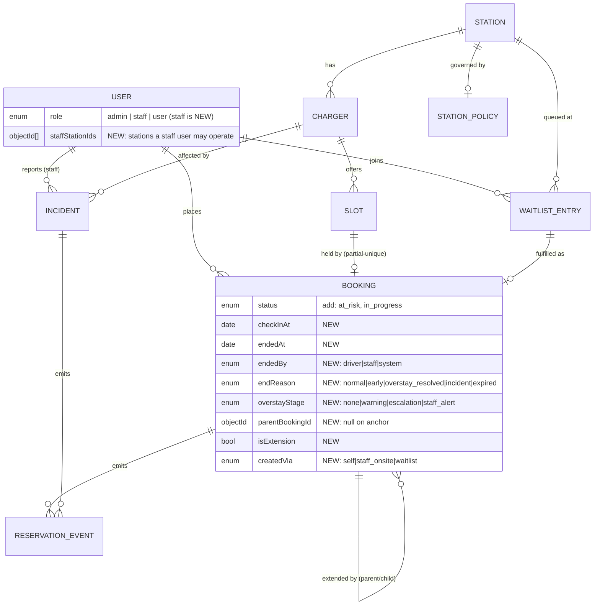

### 2.3 New collections

| Collection (mongoose name) | Purpose |
|---|---|
| `waitlistentries` | Remote and on-site waitlist queue with priority + time-limited offers. |
| `incidents` | Staff-reported technical failures on a charger; anchor for delay propagation. |
| `reservationevents` | **Append-only** lifecycle event log; the single source for analytics + audit. |

`STATION_POLICY` is stored as a `policy` sub-document on `stations` (with platform defaults),
not a separate collection — see §10.6.

---

## 3. Updated reservation lifecycle (narrative)

1. **Create → Confirmed.** Unchanged: the driver (or staff, on-site) claims a slot; the
   atomic claim marks the slot `booked` and the reservation `confirmed`. Event: `created`,
   `confirmed`.
2. **Awaiting arrival.** The reservation is `confirmed` until its start time.
3. **Check-in.** At the bay, the driver/staff starts the session (QR or staff panel). The
   reservation goes `confirmed → in_progress`, `checkInAt` is stamped. Event: `checked_in`.
4. **Grace & At Risk.** If no check-in by `start + gracePeriod`, the Transition Engine moves
   `confirmed → at_risk`. **The interval is *not* released** — the driver may still arrive.
   Event: `at_risk`; notification to driver.
5. **Late arrival.** A check-in during the at-risk window moves `at_risk → in_progress`
   (recorded as a late arrival for analytics).
6. **No-show.** If still no check-in by `start + gracePeriod + atRiskWindow`, the engine moves
   `at_risk → no_show` and **releases the interval** (which fires the waitlist matcher).
   Event: `no_show`.
7. **Extensions.** While `in_progress`, the driver may request more time. Auto-granted if the
   adjacent slot is free; partial if only part is free; refused (offer waitlist/relocate) if
   the next slot is already held. Staff may grant an *exceptional* extension that overlaps a
   future reservation, which triggers delay propagation. Events: `extension_requested`,
   `extension_granted` / `extension_partial` / `extension_denied`.
8. **Early departure.** Staff ends an active session before its reserved end. The reservation
   goes `in_progress → completed` (`endReason = early`), and **all remaining held intervals
   are released immediately** → waitlist matcher runs. Event: `early_departure`,
   `session_ended`.
9. **Overstay.** If `in_progress` past its (possibly extended) end with no end signal, the
   engine walks the overstay ladder on `overstayStage`: `warning → escalation → staff_alert`
   (notifications to driver, then staff). The reservation stays `in_progress` until ended.
   No fee. Events: `overstay_warning`, `overstay_escalation`, `overstay_staff_alert`.
10. **Normal end.** Staff (or a future check-out signal) ends the session:
    `in_progress → completed` (`endReason = normal` or `overstay_resolved`). Slots move
    `booked → completed`. Event: `session_ended`.

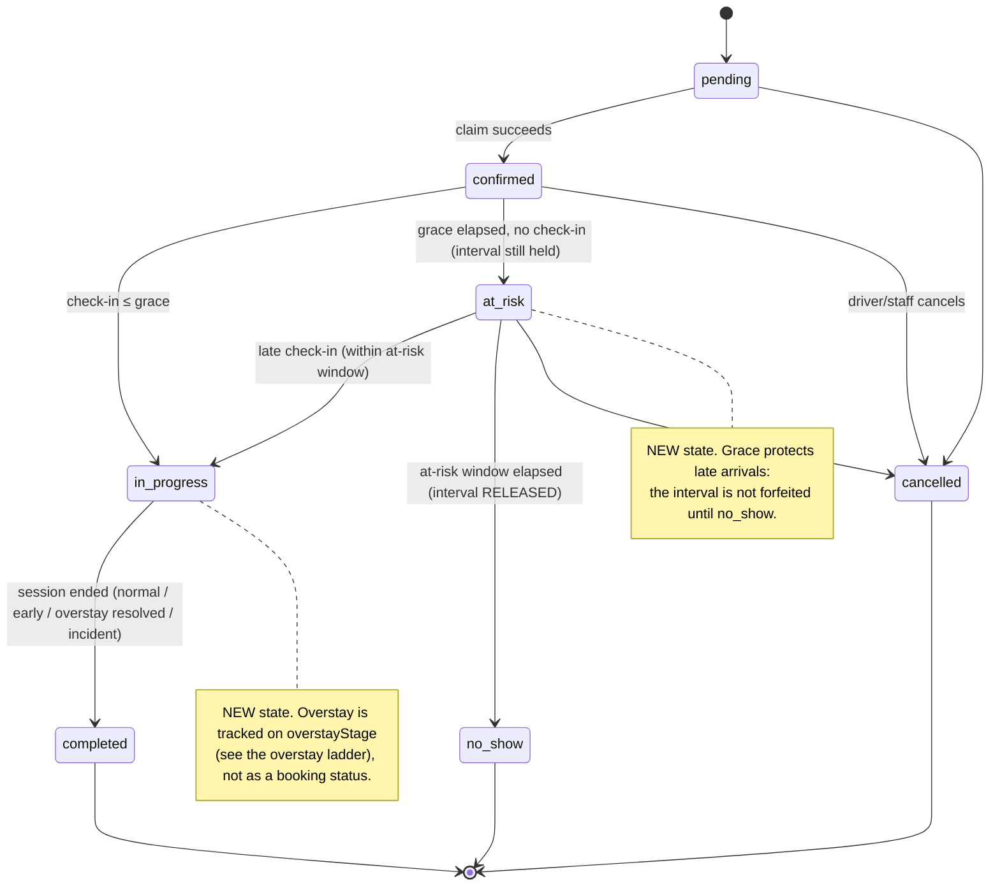

---

## 4. State machines

### 4.1 Reservation status (`bookings.status`)

Enum after v2 (**additive** — existing values keep their meaning):
`pending · confirmed · at_risk (NEW) · in_progress (NEW) · completed · cancelled · no_show`.

Allowed transitions (superset of today's guard — nothing removed):

| From | To (allowed) | Trigger |
|---|---|---|
| pending | confirmed, cancelled | claim / abandon |
| confirmed | in_progress, at_risk, cancelled | check-in / grace clock / cancel |
| at_risk | in_progress, no_show, cancelled | late check-in / clock / cancel |
| in_progress | completed | session end (any reason) |
| completed / cancelled / no_show | — | terminal |

> Migration note: today `confirmed → completed` and `confirmed → no_show` are direct. v2
> routes them through `in_progress` / `at_risk`. The existing direct transitions stay legal
> (so historical/records and edge paths don't break) but the normal path uses the new states.

### 4.2 Overstay ladder (`bookings.overstayStage`, only meaningful while `in_progress`)

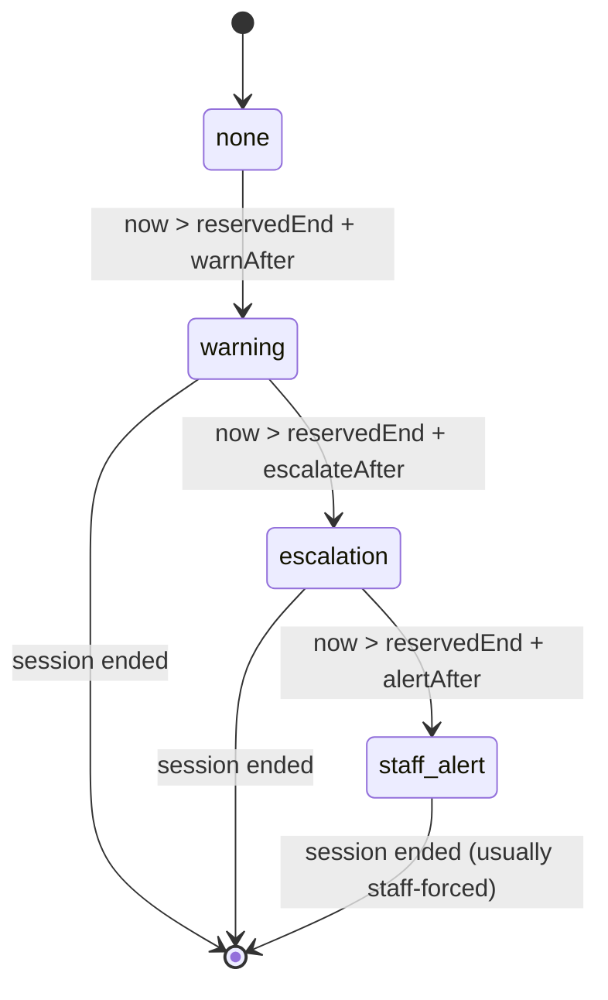

### 4.3 Session view (derived, not a stored status)

The "session" is the anchor reservation while `in_progress` plus its live extensions. Its
timeline: `checkInAt` → (0..n extensions push the end out) → `endedAt`. `endReason` records
*how* it ended: `normal | early | overstay_resolved | incident | expired`.

### 4.4 Waitlist entry (`waitlistentries.status`)

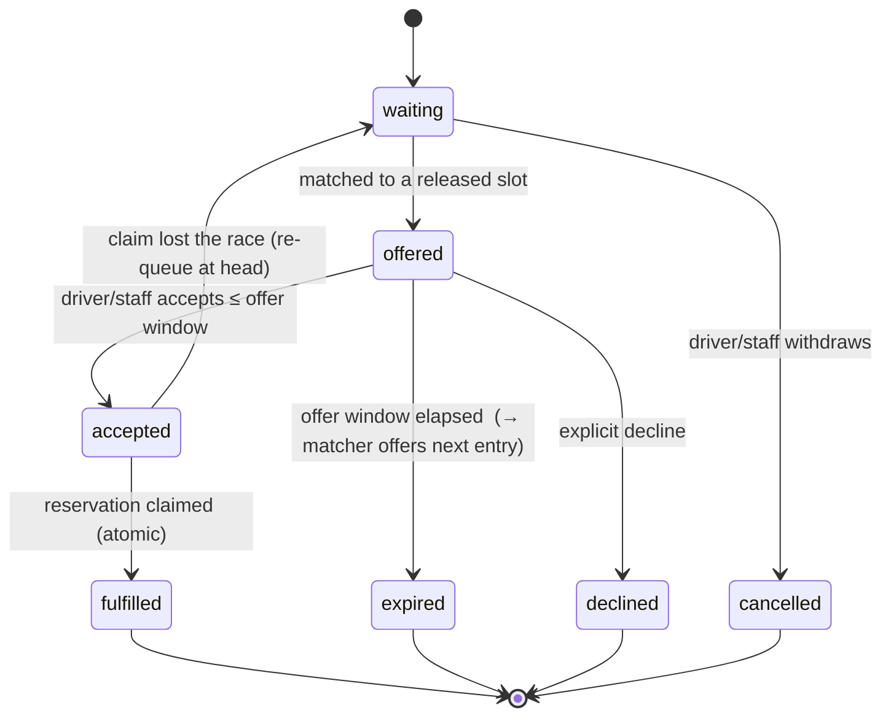

### 4.5 Incident (`incidents.status`)

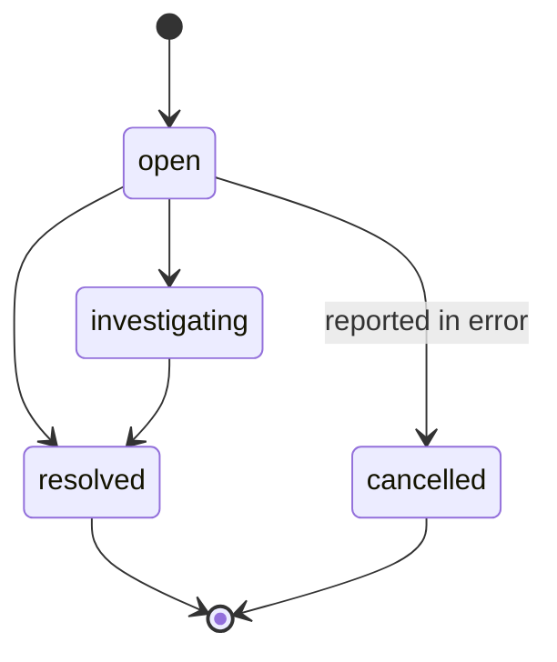

### 4.6 Slot (`slots.status`) — clarified, no new values

`available · booked · blocked · completed` (unchanged enum). v2 clarifies usage:
`blocked` = taken out of bookable service (maintenance **or an open incident**);
release on cancel/no_show/early-departure returns `booked → available`.

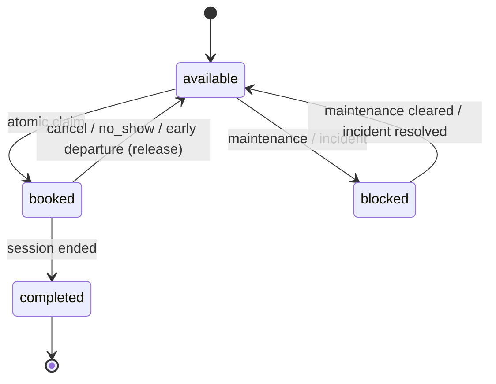

### 4.7 Charger (`chargers.status`) — unchanged

`available · in_use · maintenance · offline`. Operator-declared. Incidents may set
`maintenance`/`offline`; occupancy is never written here (still on the interval).

---

## 5. Business rules

Grouped by feature. Thresholds reference the **station policy** (§10.6); values shown are the
proposed platform defaults.

### 5.1 Grace & At Risk
- **BR-G1.** A `confirmed` reservation with no check-in by `startTime + gracePeriod`
  (default **10 min**) becomes `at_risk`. The interval remains held.
- **BR-G2.** An `at_risk` reservation with no check-in by
  `startTime + gracePeriod + atRiskWindow` (default **+15 min**, i.e. 25 min late) becomes
  `no_show`; its interval(s) are released, firing the waitlist matcher.
- **BR-G3.** A check-in while `confirmed` or `at_risk` starts the session (`in_progress`) and
  records lateness = `checkInAt − startTime` (0 if early/on-time).
- **BR-G4.** Staff may check a driver in manually (on-site) at any point before `no_show`.

### 5.2 Extensions
- **BR-E1.** Extensions are only valid while `in_progress`.
- **BR-E2.** **Auto-approve:** if the immediately-following slot on the same charger is
  `available`, it is claimed atomically and linked (`isExtension`, `parentBookingId`).
- **BR-E3.** **Partial:** a request for *k* blocks where only *j < k* consecutive following
  slots are free grants *j* and reports the shortfall.
- **BR-E4.** **Conflict:** if the next slot is already held, the driver cannot self-extend;
  the system offers to join the waitlist or (staff) relocate.
- **BR-E5.** **Exceptional (staff):** staff may grant an extension that overlaps a future
  reservation. This **requires delay propagation** (§5.6) on the overlapped reservation(s)
  and is logged with the acting staff id. Drivers can never self-serve this.
- **BR-E6.** `maxExtensionBlocks` (default **4** = 2 h) caps cumulative extension per session.

### 5.3 Early departure
- **BR-D1.** Staff can end any `in_progress` session (`endReason = early`).
- **BR-D2.** On early end, **all remaining held intervals of that session are released
  immediately** (`booked → available`), and the waitlist matcher runs for each.
- **BR-D3.** Early end is `completed`, not `cancelled` — it was fulfilled, just shorter.
  Analytics record actual < reserved duration.

### 5.4 Staff role & authority
- **BR-S1.** `staff` is a new role, **scoped to `staffStationIds`**. A staff user may act only
  on chargers/reservations/waitlists at their assigned station(s).
- **BR-S2.** Staff may: start a session (check-in), end a session (normal/early), create an
  on-site reservation, manage the waitlist (create on-site entries, offer, accept on behalf),
  report/resolve incidents, and approve exceptional extensions (BR-E5).
- **BR-S3.** Staff may **not**: change pricing, publish inventory, manage users, or edit
  platform-wide settings — those remain `admin` (operator/owner).
- **BR-S4.** Every staff action writes a `reservationevent` with `actorId`/`actorRole`.

### 5.5 Waitlist
- **BR-W1.** Two types: **remote** (driver joins from the app, must have an account) and
  **on-site** (created by staff at the station; may be a walk-in with just name/phone).
- **BR-W2.** **Priority: on-site outranks remote.** Within a type, order is FIFO by join time.
  Priority is computed as `(type_weight, createdAt)` — on-site weight strictly higher.
- **BR-W3.** When an interval is released (cancel, no_show, early departure, incident
  relocation freeing a slot), the matcher offers it to the highest-priority *compatible*
  waiting entry (station match; charger/connector filter if specified).
- **BR-W4.** An offer is **time-limited** (`waitlistOfferWindowMinutes`, default **10 min**).
  On accept → atomic claim → `fulfilled`. On expiry/decline → offer the next entry.
- **BR-W5.** If an accepted claim loses the atomic race (another claimant won), the entry
  returns to `waiting` at the head and the matcher continues — the DB index remains the sole
  arbiter, exactly as for normal claims.
- **BR-W6.** A driver holding an active reservation for the same window cannot double-book via
  the waitlist.

### 5.6 Overstay & delay propagation
- **BR-O1.** Overstay ladder on `overstayStage`: `warning` at `reservedEnd + 5 min`,
  `escalation` at `+15 min`, `staff_alert` at `+25 min` (defaults). Notifications escalate
  driver → driver → **station staff**.
- **BR-O2.** Overstay carries **no fee** in v2 (see §1). Resolution is operational: staff end
  the session when the bay is needed.
- **BR-O3.** **Delay propagation** runs when (a) an incident takes a charger out of service,
  or (b) staff grant an exceptional extension, or (c) an overstay is projected to collide with
  the next reservation. For each affected upcoming reservation, in order of preference:
  **relocate** (atomic-claim an equivalent free slot on another compatible charger at the same
  station) → **delay** (offer the next free slot on the same charger) → **cancel + waitlist +
  notify**. Every outcome emits an event and a notification.
- **BR-O4.** Relocation must satisfy connector compatibility and be ≥ the original power where
  possible; if only lower power is available it is offered, not forced.

### 5.7 Incidents
- **BR-I1.** Only staff/admin may open an incident, and only for a charger at their station.
- **BR-I2.** Opening an incident may set the charger `maintenance`/`offline` and blocks its
  future `available` slots (`available → blocked`); **it never deletes reservations** — those
  go through delay propagation.
- **BR-I3.** Resolving an incident clears `blocked → available` for still-future slots and may
  return the charger to `available`.

### 5.8 Invariant guards (unchanged, restated)
- **BR-X1.** No two live reservations may hold one interval — enforced by the partial unique
  index, for normal claims, extensions, waitlist acceptances and relocations alike.
- **BR-X2.** A released interval must map to no live reservation, and a `booked` interval must
  map to exactly one — the existing reconciliation invariant, now also covering extension
  child reservations.

---

## 6. User (driver) journeys

### 6.1 Late arrival within grace
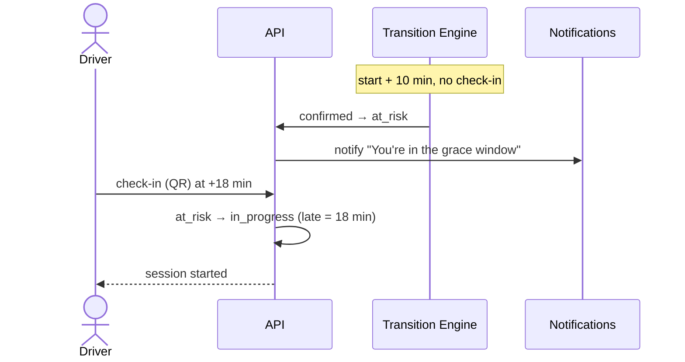

### 6.2 Request an extension
```mermaid
sequenceDiagram
    actor D as Driver
    participant API
    participant DB
    D->>API: POST /sessions/{id}/extend {blocks:1}
    API->>DB: atomic claim adjacent slot (partial unique index)
    alt slot free
        DB-->>API: claimed → child reservation linked
        API-->>D: extended to new end time
    else next slot held
        API-->>D: cannot extend; offer waitlist / ask staff
    end
```

### 6.3 Join the remote waitlist and accept an offer
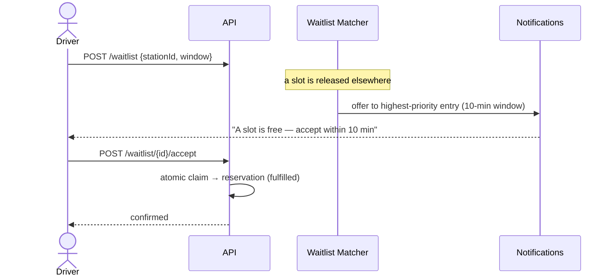

Other driver journeys unchanged: browse/reserve, cancel (releases interval), view my
reservations/sessions/notifications.

---

## 7. Staff journeys

### 7.1 On-site check-in and end (incl. early departure)
```mermaid
sequenceDiagram
    actor S as Staff
    participant API
    participant M as Waitlist Matcher
    S->>API: POST /staff/sessions/start {bookingId}
    API->>API: confirmed|at_risk → in_progress
    Note over S: driver leaves early
    S->>API: POST /staff/sessions/end {bookingId, reason:early}
    API->>API: in_progress → completed; release remaining slots
    API->>M: run matcher on each freed slot
```

### 7.2 Create an on-site reservation / on-site waitlist entry
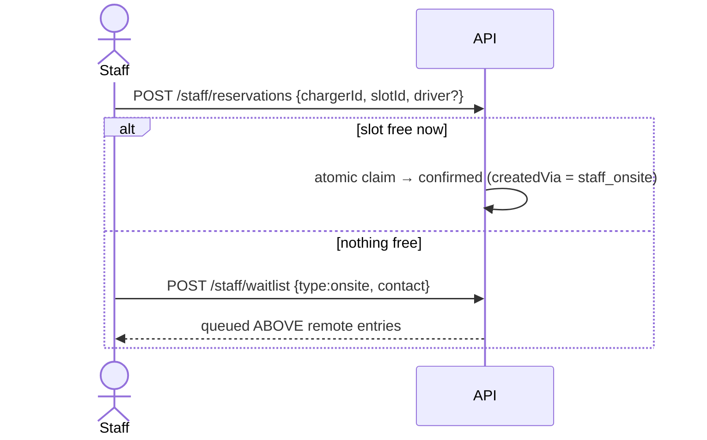

### 7.3 Report an incident → delay propagation
```mermaid
sequenceDiagram
    actor S as Staff
    participant API
    participant P as Delay Propagation
    participant N as Notifications
    S->>API: POST /staff/incidents {chargerId, type, severity, estimatedClearAt}
    API->>API: charger → maintenance; future slots → blocked
    API->>P: propagate over affected reservations
    loop each affected reservation
        P->>P: relocate → else delay → else cancel+waitlist
        P->>N: notify affected driver of new plan
    end
```

### 7.4 Approve an exceptional extension
```mermaid
sequenceDiagram
    actor S as Staff
    participant API
    participant P as Delay Propagation
    S->>API: POST /staff/sessions/{id}/extend {blocks, exceptional:true}
    API->>API: extend session past a future reservation
    API->>P: propagate over the overlapped reservation(s)
    API-->>S: extended; affected drivers re-planned
```

---

## 8. Admin (operator/owner) workflows

Admin keeps every current power (inventory publication, pricing, station/charger CRUD, user
management, honest estimated-revenue reporting) and gains:

- **Staff management:** create staff users, assign/revoke `staffStationIds`.
- **Station policy:** set grace/at-risk/overstay/offer thresholds and extension caps per
  station (§10.6), with platform defaults.
- **Operational oversight:** view live board (per charger: current session, overstay stage,
  waitlist depth, open incidents) across all stations; staff see only their station(s).
- **Analytics dashboard:** the metrics in §12, filterable by station/charger/time.
- **Incident review:** see all incidents and the propagation outcomes they caused.

Admin does **not** perform routine on-site actions (check-in/end/waitlist) except as a
superset of staff for support purposes.

---

## 9. Architecture diagrams

### 9.1 System context (services)
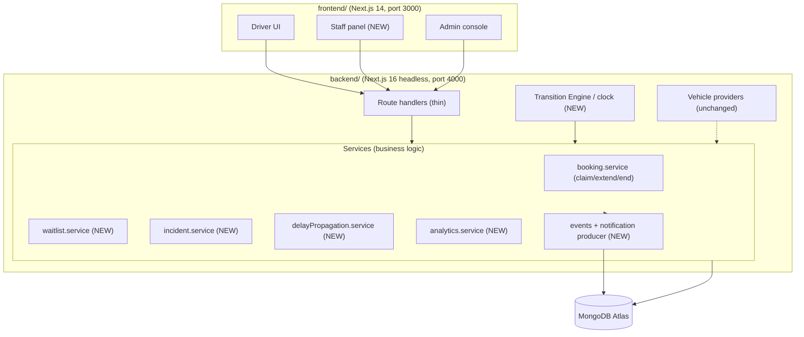

### 9.2 Transition Engine (the clock)
A server-side scheduled sweep (cron-invoked internal endpoint protected by a shared secret,
or a worker interval), running ~every minute. **Idempotent**: every state change is a
conditional update, so re-running a tick is a no-op. Each tick, in one pass:

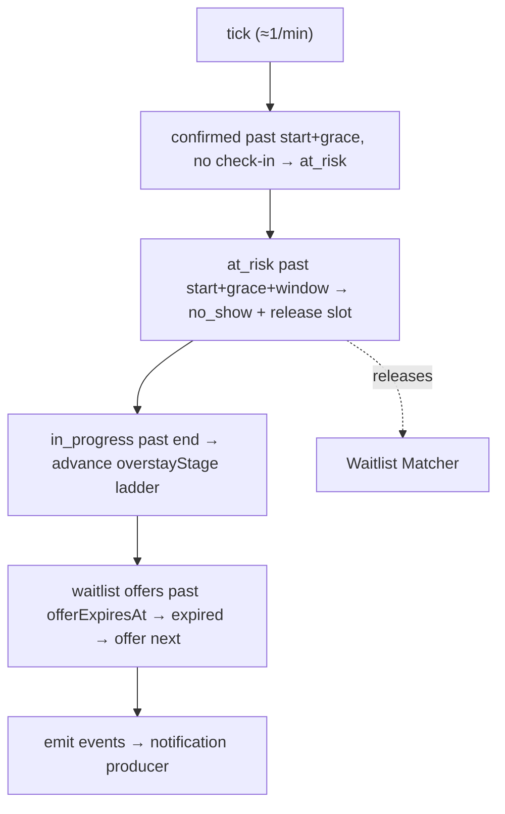

### 9.3 Event → notification (finally wired)
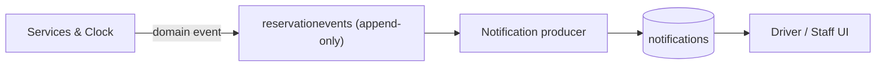
Notifications remain a **consumer** of events — the reservation flow never calls the sender
directly (carried over from `CLAUDE.md` §7).

### 9.4 Waitlist matcher
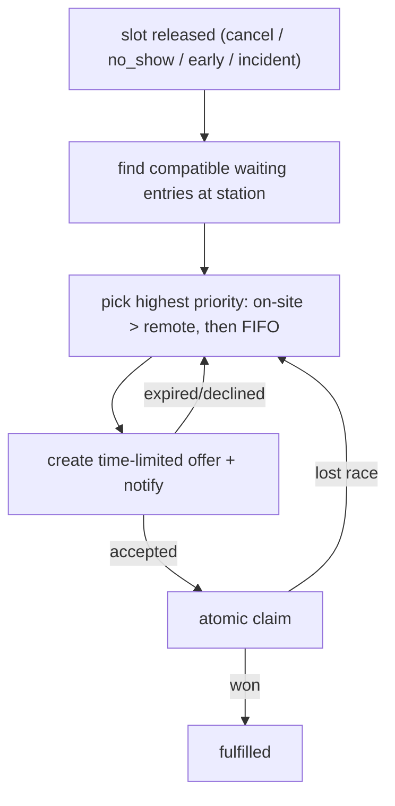

---

## 10. Database requirements (additive)

All changes are additive: new enum values, new optional fields, new collections, new indexes.
No rename, no destructive migration. Backfill defaults for existing rows where noted.

### 10.1 `users` (extend)
- `role`: add value **`staff`** → `admin | staff | user`.
- **NEW** `staffStationIds: ObjectId[]` (ref Station), default `[]`. Only meaningful for staff.
- Index: `{ role: 1 }` (already common); consider `{ staffStationIds: 1 }` for staff lookups.

### 10.2 `bookings` (extend)
- `status`: add **`at_risk`**, **`in_progress`** → 7 values total.
- **NEW** `checkInAt: Date`, `endedAt: Date`.
- **NEW** `endedBy: enum[driver, staff, system]`, `endReason: enum[normal, early, overstay_resolved, incident, expired]`.
- **NEW** `overstayStage: enum[none, warning, escalation, staff_alert]`, default `none`.
- **NEW** `parentBookingId: ObjectId` (ref Booking, null on anchor), `isExtension: Boolean` default `false`.
- **NEW** `createdVia: enum[self, staff_onsite, waitlist]`, default `self`.
- **NEW (optional)** `waitlistEntryId: ObjectId` when created from an offer.
- Indexes: keep the **partial unique on `slotId`** (now also covers extension children).
  Add `{ chargerId: 1, status: 1 }` and `{ status: 1, startTime: 1 }` to make the clock sweep
  and the live board efficient. Add `{ parentBookingId: 1 }`.

### 10.3 `slots` (no schema change)
- Enum unchanged. Usage of `blocked` extended to incidents (§4.6). No migration.

### 10.4 `waitlistentries` (NEW)
- `type: enum[remote, onsite]` (required).
- `userId: ObjectId` (ref User; required for remote).
- `contactName: String`, `contactPhone: String` **(`select:false`)** — walk-in on-site only.
- `stationId: ObjectId` (required), `chargerId: ObjectId` (optional filter),
  `connectorType: enum[CCS, CHAdeMO, Type2]` (optional), `vehicleId: ObjectId` (optional).
- `desiredStart: Date`, `desiredEnd: Date` (optional window).
- `priority: Number` (computed: on-site weight > remote; tiebreak `createdAt`).
- `status: enum[waiting, offered, accepted, fulfilled, expired, declined, cancelled]`, default `waiting`.
- `offeredSlotId`, `offeredBookingId`, `offerExpiresAt: Date`.
- `createdBy: ObjectId` (ref User; the staff member for on-site), `notes: String`.
- Indexes: `{ stationId: 1, status: 1, priority: -1, createdAt: 1 }` (matcher),
  `{ userId: 1, status: 1 }` (my waitlist), `{ status: 1, offerExpiresAt: 1 }` (expiry sweep).

### 10.5 `incidents` (NEW)
- `chargerId` (required), `stationId`, `reportedBy` (ref User, staff).
- `type: enum[hardware_fault, power_outage, connector_damage, vandalism, other]`.
- `severity: enum[low, medium, high, critical]`.
- `status: enum[open, investigating, resolved, cancelled]`, default `open`.
- `startedAt: Date`, `estimatedClearAt: Date`, `resolvedAt: Date`.
- `affectedBookingIds: ObjectId[]` (snapshot at report), `resolutionNotes: String`.
- Indexes: `{ chargerId: 1, status: 1 }`, `{ stationId: 1, status: 1 }`.

### 10.6 `stations.policy` (NEW sub-document, with platform defaults)
- `gracePeriodMinutes` (10), `atRiskWindowMinutes` (15),
  `overstayWarningMinutes` (5), `overstayEscalationMinutes` (15), `overstayStaffAlertMinutes` (25),
  `waitlistOfferWindowMinutes` (10), `extensionBlockMinutes` (30), `maxExtensionBlocks` (4).
- Missing values fall back to a single platform-defaults constant, so existing stations need
  no backfill.

### 10.7 `reservationevents` (NEW, append-only)
- `bookingId` (nullable), `stationId`, `chargerId`.
- `type: enum[created, confirmed, checked_in, at_risk, extension_requested, extension_granted, extension_partial, extension_denied, early_departure, session_ended, overstay_warning, overstay_escalation, overstay_staff_alert, no_show, cancelled, incident_reported, incident_resolved, waitlist_joined, waitlist_offered, waitlist_accepted, waitlist_expired, relocated, delayed]`.
- `actorId: ObjectId`, `actorRole: enum[driver, staff, admin, system]`, `at: Date`.
- `meta: Mixed` (e.g. `minutesLate`, `fromChargerId`, `toChargerId`, `delayMinutes`, `blocks`).
- **Append-only:** no update/delete path, ever. Indexes: `{ stationId: 1, at: -1 }`,
  `{ type: 1, at: -1 }`, `{ bookingId: 1, at: 1 }`.

### 10.8 `notifications` (extend enum)
- Add types: `at_risk, extension_offer, extension_granted, waitlist_offer, waitlist_expired, session_ended, overstay_warning, incident_delay, relocated`. Additive only.

---

## 11. API requirements

Thin route handlers → services, Zod at the boundary, `errorResponse` sentinels, ownership/role
scoping in-query. New guard: **`requireStaff(req, stationId)`** (async, station-scoped).

### 11.1 Driver
| Method & path | Purpose |
|---|---|
| `POST /api/sessions/{bookingId}/check-in` | Start the session (QR). `confirmed|at_risk → in_progress`. |
| `POST /api/sessions/{bookingId}/extend` | Request extension `{blocks}`. Auto/partial/deny. |
| `GET /api/sessions/mine` | My active/past sessions (derived view). |
| `POST /api/waitlist` | Join remote waitlist `{stationId, chargerId?, window?}`. |
| `GET /api/waitlist/mine` | My waitlist entries + any live offer. |
| `POST /api/waitlist/{id}/accept` · `/decline` | Respond to an offer within the window. |
| `DELETE /api/waitlist/{id}` | Withdraw (→ cancelled). |

### 11.2 Staff (all `requireStaff`, station-scoped)
| Method & path | Purpose |
|---|---|
| `POST /api/staff/sessions/start` | Check a driver in on-site. |
| `POST /api/staff/sessions/end` | End a session `{reason: normal|early}`; release remaining slots. |
| `POST /api/staff/sessions/{id}/extend` | Grant extension, incl. `{exceptional:true}` → delay propagation. |
| `POST /api/staff/reservations` | Create an on-site reservation (atomic claim). |
| `POST /api/staff/waitlist` | Create an on-site entry (higher priority). |
| `POST /api/staff/waitlist/{id}/offer` · `/accept` | Manually offer/accept on behalf. |
| `POST /api/staff/incidents` · `PATCH /api/staff/incidents/{id}` | Report / update / resolve an incident. |
| `GET /api/staff/board` | Live board for the assigned station(s). |

### 11.3 Admin
| Method & path | Purpose |
|---|---|
| `POST /api/admin/staff` · `PATCH /api/admin/staff/{id}` | Create staff, set `staffStationIds`. |
| `PATCH /api/admin/stations/{id}/policy` | Set per-station thresholds. |
| `GET /api/admin/analytics` | Metrics in §12 (filters: station, charger, range). |
| `GET /api/admin/incidents` | All incidents + propagation outcomes. |

### 11.4 Internal
| Method & path | Purpose |
|---|---|
| `POST /api/internal/tick` | Transition-Engine sweep. Auth by shared secret; idempotent. |

New sentinel errors (mapped in `errorResponse`): `NOT_IN_PROGRESS`, `EXTENSION_CONFLICT`,
`EXTENSION_CAP_REACHED`, `OFFER_EXPIRED`, `OFFER_NOT_YOURS`, `INCIDENT_FORBIDDEN`,
`STAFF_STATION_SCOPE`, `WAITLIST_DUPLICATE`.

---

## 12. Analytics

Single source of truth: **`reservationevents`** (append-only) joined with `bookings`. Metrics
are aggregation pipelines (no generated text — consistent with "the assistant has no LLM").

| Metric | Definition | Source |
|---|---|---|
| **Arrival Accuracy** | % of `checked_in` where `minutesLate ≤ grace`; distribution of `checkInAt − startTime`. | events `checked_in` (`meta.minutesLate`) |
| **Average Delay** | mean `minutesLate` over late check-ins (`> grace`). | events `checked_in` |
| **Extension Frequency** | extensions per session; % of sessions with ≥1 extension. | events `extension_granted|partial`, bookings `isExtension` |
| **No-Show Rate** | `no_show` ÷ reservations that reached their start window. | bookings/events `no_show` |
| **Avg Reserved Duration** | mean(`endTime − startTime`) incl. granted extensions, per anchor session. | bookings (anchor + extensions) |
| **Avg Actual Duration** | mean(`endedAt − checkInAt`). | bookings `checkInAt`/`endedAt` |
| **Charger Utilization** | actually-charging time ÷ serviceable time, per charger. | bookings + charger serviceable windows |
| **Station Utilization** | charger utilization aggregated over a station. | above, grouped by `stationId` |

Supporting operational metrics (free from the same log): overstay frequency by stage,
waitlist conversion (`offered → fulfilled`) and offer-expiry rate, incident count/MTTR,
relocation vs delay vs cancel mix from delay propagation.

---

## 13. Architecture decisions (ADR summary)

- **ADR-1 — Time-driven Transition Engine.** *At Risk*, no-show, overstay escalation and offer
  expiry are time-triggered. Introduce an idempotent, conditionally-guarded server-side sweep
  (`/api/internal/tick`). *Alternative rejected:* per-request lazy evaluation — leaves stale
  states when no one calls, and can't send proactive notifications.
- **ADR-2 — Session as fields on the anchor reservation + extension children, not a new
  `sessions` collection.** Keeps the slot↔reservation invariant exactly 1:1, reuses the atomic
  claim for extensions, needs no new reconciliation. *Alternative rejected:* separate
  `sessions` collection — cleaner conceptually but duplicates the holding relationship and
  forces a second integrity invariant.
- **ADR-3 — Extensions reuse the atomic slot claim.** An extension is a child reservation
  claiming the adjacent slot; the partial unique index prevents any overlap. *Alternative
  rejected:* mutating `endTime` on the anchor — would let a reservation silently grow over a
  neighbour with no DB guard.
- **ADR-4 — Waitlist acceptance goes through the same claim, DB as sole arbiter.** No "hold"
  side-channel; a lost race simply re-queues. Keeps one source of truth for conflicts.
- **ADR-5 — Overstay is operational, not financial.** Escalation to staff, no fee. Preserves
  "money is estimated; no payments." Fees remain future work behind a payment integration.
- **ADR-6 — Staff role is station-scoped (`staffStationIds`).** Least authority; on-site powers
  only, no platform settings. *Alternative rejected:* a global "staff" with blanket access.
- **ADR-7 — Append-only `reservationevents` as the analytics/audit spine.** One write path, no
  recomputation, immutable history. Consistent with the project's audit philosophy.
- **ADR-8 — Notifications are event consumers.** The clock/services emit events; a producer
  turns events into notifications. Services never call the sender directly.

---

## 14. Decisions needed from the owner

1. **Grace/overstay defaults** — are 10 / +15 min (no-show at 25 late) and overstay 5/15/25
   reasonable for your stations, or should they be tuned per station from day one?
2. **Walk-in on-site waitlist** — do we store a walk-in's name/phone (needs the `select:false`
   contact fields), or only queue account-holders?
3. **Relocation aggressiveness** — on an incident, prefer relocating drivers to another charger
   automatically, or always ask the driver first? (Affects notification/consent flow.)
4. **Clock cadence & host** — every 1 min via an external cron hitting `/api/internal/tick`,
   or a long-running worker? (For the demo, a 1-min cron is simplest.)
5. **Presentation scope** — how much of v2 do you want to *demo live* vs *describe*? (The
   Transition Engine and waitlist are the most impressive to show.)

---

## 15. Suggested implementation sequencing (non-binding; no code yet)

Phased so each step ships behind the invariants and is independently verifiable:

1. **Schema + policy** (additive fields/enums/collections, indexes via `ops:indexes`).
2. **Event log + notification producer** (wire the event→notification path first — everything
   else emits into it).
3. **Check-in + session end + early departure** (introduces `in_progress`, release-on-early).
4. **Transition Engine** (grace → at_risk → no_show; overstay ladder).
5. **Extensions** (auto/partial via atomic claim).
6. **Waitlist** (remote first, then on-site + priority; matcher on release).
7. **Staff role & panel** (guard, scoped endpoints, on-site actions).
8. **Incidents + delay propagation** (relocate/delay/cancel) and **exceptional extensions**.
9. **Analytics dashboard** (aggregations over the event log).

Each step: update `CLAUDE.md` invariants as it lands, verify against the live database
(concurrent-claim tests still pass for extensions and waitlist acceptances), keep CI green.

---

*This is a design specification. No code has been written. Nothing here overrides `CLAUDE.md`
until the corresponding step is implemented and verified.*
