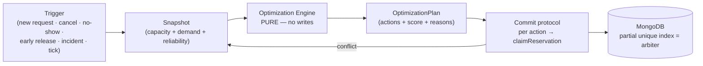
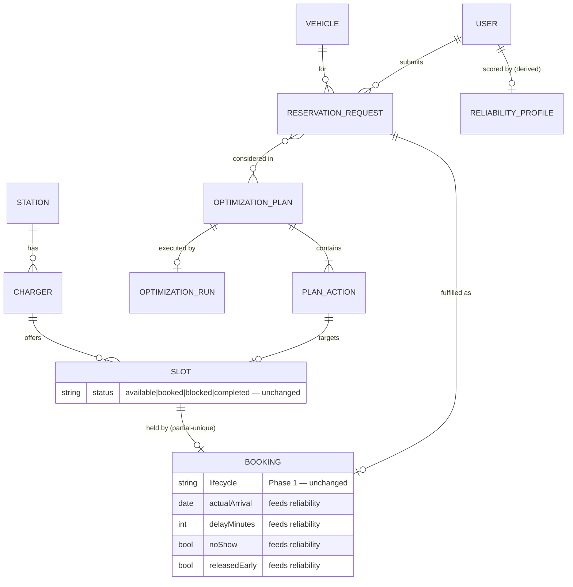
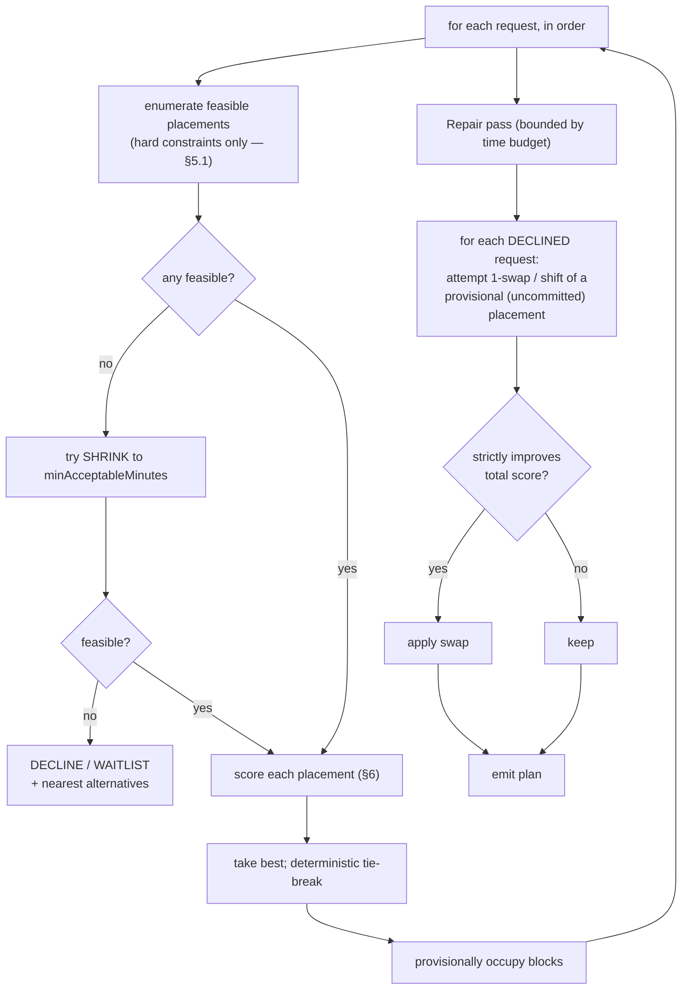

# ChargeHub — Reservation Optimization Engine (Architecture)

**Status: DESIGN — no code.** Extends `RESERVATION_ARCHITECTURE_V2.md`. Depends on data the
implemented **Phase 1** already collects (`noShow`, `delayMinutes`, `releasedEarly`,
`actualArrival/Start/End`, `extensionCount`) and the **Phase 2** staff surface.

---

## 0. What this is, and what it must never become

Today a reservation is **first-come-first-served over a fixed grid**: a driver picks one
30-minute slot on one charger, and the atomic claim either grants it or refuses it. That is
correct but *passive* — it never asks whether a different arrangement of the same day would
have served more drivers.

The Optimization Engine is the **advisory layer** that asks exactly that. It reads a snapshot
of demand and capacity, and produces a **plan**: a set of proposed assignments and moves that
scores better against two objectives — **served customers** and **charger utilization** —
subject to real-world constraints.

**Three boundaries are absolute:**

| Boundary | Why |
|---|---|
| **The engine never writes reservations.** It emits a plan; every action is materialized through the existing `claimReservation`, one atomic claim at a time. | The partial unique index on `bookings.slotId` stays the **sole arbiter** of conflicts. An optimizer that wrote directly would become a second, unguarded source of truth — the exact failure `CLAUDE.md` §2 forbids. |
| **The engine is a pure function of its inputs.** Snapshot in → plan out. No DB writes, no clock reads, no randomness. | Reproducible, unit-testable, and demonstrable. A plan can be shown, explained, and diffed before anything commits. |
| **A committed reservation is never moved without consent.** Only *unfulfilled requests* are freely assignable. | Silently relocating a driver who already holds a confirmed booking is a trust violation, not an optimization. |

**Non-goals:** it is not a solver-grade MILP (see ADR-3), it does not price or bill anything
(money remains estimated), it does not control hardware, and it uses **no LLM** — it is
arithmetic and search over a time grid.



---

## 1. Domain Model

### 1.1 The central new idea: separate the *desire* from the *hold*

The model gains one concept that unlocks everything else:

- **Reservation** (existing, `bookings`) — a **committed hold** on a specific interval.
  Guaranteed, conflict-free, DB-enforced. Unchanged.
- **ReservationRequest** (NEW) — a **desire** for charging: "≈60 minutes, at Hamra or Ashrafieh,
  any time between 14:00 and 18:00, CCS, ideally ≥50 kW." Not a hold. Nothing is guaranteed.

This separation is what makes optimization possible. A grid of rigid single-slot bookings has
nothing to optimize; a pool of *windowed, flexible requests* does. It also unifies three things
that were previously separate designs:

> **A waitlist entry is simply a `ReservationRequest` that is not yet `FULFILLED`.**
> A "booking" is a request that was fulfilled immediately. There is no separate waitlist
> collection — the waitlist *is* the request pool filtered by status.

### 1.2 New entities

| Entity | Kind | Purpose |
|---|---|---|
| **ReservationRequest** | collection `reservationrequests` | A windowed, flexible demand for charging. Supersedes the planned `waitlistentries`. |
| **FlexibilityProfile** | embedded in request | How much the customer will bend: time, charger, station, duration, power. |
| **ReliabilityProfile** | collection `reliabilityprofiles` (derived) | Per-user behavioural score from historical outcomes. Recomputed, never hand-edited. |
| **CapacitySnapshot** | in-memory only | The time grid: chargers × intervals with current occupancy. Never persisted. |
| **OptimizationPlan** | collection `optimizationplans` | The engine's output: ordered actions, projected metrics, per-decision reasons. |
| **PlanAction** | embedded in plan | One proposed operation (ASSIGN / OFFER / RESCHEDULE / SHRINK / DECLINE …). |
| **OptimizationRun** | append-only `optimizationruns` | Audit of an execution: trigger, inputs digest, score, what committed, what failed. |

### 1.3 ReservationRequest — the pivot entity

```
ReservationRequest
  userId, vehicleId
  status:        DRAFT | PENDING | OFFERED | ACCEPTED | FULFILLED | DECLINED | EXPIRED | CANCELLED
  origin:        self | staff_onsite | waitlist | system_replan
  # ---- what they want
  desiredMinutes            e.g. 60   (→ 2 blocks of 30)
  minAcceptableMinutes      e.g. 30   (partial charge acceptable)
  earliestStart / latestEnd            the window; window > duration ⇒ time flexibility
  preferredStationIds[]                ranked
  acceptableStationIds[]               superset (station flexibility)
  preferredChargerId?                  null ⇒ any charger (charger flexibility)
  connectorType                        HARD — from the vehicle
  minPowerKW? / preferredPowerKW?      power flexibility
  # ---- how much they'll bend
  flexibility: FlexibilityProfile
  # ---- lifecycle bookkeeping
  priorityClass:  standard | onsite | recovery      (recovery = displaced by an incident)
  createdAt, expiresAt
  offeredPlanId?, offeredSlotIds[], offerExpiresAt?
  fulfilledBookingId?
  passedOverCount                      starvation guard (see §6.5)
```

`FlexibilityProfile` is a small, explicit vector — not a vague "flexible: true":

```
timeFlex:      RIGID | NARROW(±15m) | WIDE(±60m) | ANY_IN_WINDOW
chargerFlex:   FIXED_CHARGER | ANY_AT_STATION
stationFlex:   FIXED_STATION | ANY_PREFERRED | ANY_ACCEPTABLE
durationFlex:  EXACT | SHRINKABLE(to minAcceptableMinutes)
powerFlex:     MIN_ENFORCED | PREFER_HIGHER
```

### 1.4 ReliabilityProfile — derived, never authored

Computed from outcomes Phase 1 already records. **Derived data only**: recomputable from
`bookings` + `reservationevents` at any time, so it is never a source of truth and can be
rebuilt after a bug.

```
ReliabilityProfile (per userId)
  sampleSize                     completed + no_show reservations
  noShowRateSmoothed             Bayesian-smoothed (§6.2)
  meanDelayMinutes               from delayMinutes
  punctualityScore               0..1
  completionScore                0..1   (actualEnd present vs abandoned)
  goodCitizenBonus               0..0.1 (releasedEarly returned capacity)
  score                          0..1   composite, clamped to a FLOOR (§6.2)
  showProbability                0..1   P(shows up) — the only value the objective uses
  computedAt, inputsVersion
```

### 1.5 How it attaches to what exists (all additive)



**No existing collection is renamed or restructured.** `bookings`, `slots`, `chargers`,
`stations`, `users` keep their shapes; `bookings` gains one optional back-reference
(`requestId`) so a fulfilled request can be traced to its hold.

---

## 2. Optimization Inputs

The engine consumes one immutable **snapshot**. Everything it needs is read once, tagged with a
version, and never re-read mid-plan — that is what makes it pure and reproducible.

### 2.1 Capacity side

| Input | Source | Notes |
|---|---|---|
| Time grid: charger × interval | `slots` (`chargerId`, `startTime`, `endTime`, `duration`, `status`) | Only `available` is assignable; `blocked` (maintenance/incident) and `completed` are excluded. |
| Charger attributes | `chargers` (`connectorType`, `powerKW`, `status`, `stationId`) | `status` is operator-declared serviceability — `maintenance`/`offline` chargers contribute **no** capacity. |
| Station attributes | `stations` (`isActive`, `operatingHours`, `location`) | Closed hours are not assignable. |
| Existing reservations | `bookings` where `lifecycle ∈ {RESERVED, ARRIVED, CHARGING, LATE, AT_RISK, EXTENSION_REQUESTED}` | **Immovable by default** (§5.1). In-progress sessions are hard-frozen. |
| Planning horizon | config | Default: now → +72 h. Past intervals are never touched. |

### 2.2 Demand side

| Input | Source |
|---|---|
| Pending requests (incl. waitlist) | `reservationrequests` where `status ∈ {PENDING, OFFERED}` |
| The triggering request, if any | caller |
| Displaced reservations needing re-placement | incident / delay-propagation caller, as `priorityClass: recovery` |
| Extension requests | `bookings` where `lifecycle = EXTENSION_REQUESTED` + desired extra blocks |

### 2.3 Behavioural & policy side

| Input | Source | Role |
|---|---|---|
| `showProbability` per request's user | `reliabilityprofiles` | Discounts **expected** utilization (§6.2). Never a hard filter. |
| Vehicle constraints | `vehicles` (`connectorType`, `batteryCapacity`, `currentBatteryLevel`) | Connector is hard; battery informs a *suggested* duration only. |
| Station policy | `stations.policy` (grace, offer window, max extension blocks) | Bounds on offers and extensions. |
| Objective weights | `optimizationpolicy` config, per station with platform defaults | `W_serve`, `W_util`, `W_pref`, `W_frag`, `W_move`, fairness floor, time budget. |
| Snapshot version | `max(updatedAt)` across slots+bookings, or a monotonic counter | Staleness detection at commit (§4.6). |

### 2.4 What is deliberately *not* an input

Payment/price (no billing exists — utilization is the proxy for value), live telemetry
(simulated), and any free-text/LLM signal.

---

## 3. Optimization Outputs

The engine returns an **OptimizationPlan** — a proposal, never a fait accompli.

```
OptimizationPlan
  planId, snapshotVersion, generatedAt, expiresAt      (short TTL — see §4.6)
  trigger:  NEW_REQUEST | CANCELLATION | NO_SHOW_RELEASE | EARLY_RELEASE
          | EXTENSION_REQUEST | INCIDENT | INVENTORY_PUBLISHED | PERIODIC | MANUAL
  scope:    stationIds[], horizon{from,to}
  actions:  PlanAction[]                                (ordered; commit in order)
  projected: {
      servedRequests, servedDelta,
      utilizationPercent, utilizationDelta,
      expectedServed          # reliability-discounted
      requestsUnservable, movesRequiringConsent
  }
  score:    { total, breakdown{ serve, utilization, preference, fragmentation, moves, fairness } }
  unservable: [ { requestId, reason, nearestAlternatives[] } ]
  explanation: string[]        # human-readable, one line per material decision
```

### 3.1 PlanAction — the vocabulary

| Action | Meaning | Consent |
|---|---|---|
| `ASSIGN` | Fulfil a request by claiming specific slot(s) now. | Implicit (they asked) |
| `OFFER` | Time-limited offer to a waitlisted request; claim only on accept. | Driver accepts |
| `SHRINK` | Fulfil at `minAcceptableMinutes` instead of desired. | Driver informed; accept if below preference |
| `RESCHEDULE` | Same charger, different interval within the window. | **Required** if reservation is committed |
| `RELOCATE` | Different charger/station, same interval. | **Required** if committed; staff may override during an incident |
| `EXTEND` | Grant *k* extra adjacent blocks to an active session. | Implicit (they asked) |
| `DECLINE` | No feasible assignment; return reasons + alternatives. | n/a |
| `WAITLIST` | Park as `PENDING` for a future re-plan. | n/a |
| `NO_OP` | Considered, left as-is (recorded for explainability). | n/a |

### 3.2 Explainability is a first-class output

Every action carries a `reason` and every rejection carries a cause. Staff must be able to
answer "why did the system put this driver there?" at the desk, and a driver must be told *why*
they were declined and *what else* is available. A plan with no explanation is a defect.

> Example: `ASSIGN req#3F2 → charger B2 14:30–15:30 — reason: only CCS ≥50 kW window matching`
> `preference; chosen over B4 to avoid leaving a 30-min unusable gap (fragmentation −0.8).`

---

## 4. Scheduling Rules

### 4.1 The problem, honestly stated

Assigning windowed, variable-duration, resource-constrained requests to a discrete time grid is
**interval scheduling with time windows and machine eligibility** — NP-hard in general. There is
no exact algorithm that is also fast and simple. So the engine is a **deterministic greedy
construction with bounded local repair**, which is the right trade for a station-scale problem
(tens of chargers × dozens of intervals × dozens of requests) and is fully explainable.

### 4.2 The grid

Time is discretized into **blocks** matching `slots.duration` (30 min today). A request for 60
minutes needs a **contiguous run of 2 blocks on one charger**. Contiguity is a hard rule: a
driver cannot charge in two disjoint halves.

### 4.3 Phase A — Freeze

1. Mark every in-progress session (`ARRIVED`, `CHARGING`) and its blocks **immutable**.
2. Mark every committed future reservation **pinned** (movable only via a consent-bearing
   `RESCHEDULE`/`RELOCATE`, and only if the trigger authorizes moves — e.g. an incident).
3. Remove blocks that are `blocked`, `completed`, outside operating hours, or on a
   `maintenance`/`offline` charger.

### 4.4 Phase B — Order the requests

Sort by **urgency-adjusted priority**, computed once (§6.5), then by a deterministic tie-break
chain so two identical runs produce identical plans:

```
priorityClass(recovery > onsite > standard)
  → urgencyBoost (starvation guard) desc
  → window tightness (latestEnd − earliestStart − desiredMinutes) asc   # least flexible first
  → createdAt asc → requestId asc                                       # stable
```

**Tight-windows-first is the core heuristic:** a rigid request can only ever fit in one place, so
placing it before flexible ones avoids blocking it later. Flexible requests are the slack that
absorbs the remainder — which is precisely why flexibility is modelled explicitly (§1.3).

### 4.5 Phase C — Greedy placement, then bounded repair



**Repair only ever rearranges *provisional* placements made in this run** — never committed
reservations. It stops at a configured time budget (default 250 ms) or when no swap improves the
score, whichever first. Bounded work, predictable latency.

### 4.6 Phase D — Commit protocol (outside the engine)

The plan is a proposal against `snapshotVersion`. Committing is where reality gets a vote:

1. If the current version ≠ `snapshotVersion`, or the plan is past `expiresAt` → **re-plan**.
   Never force-apply a stale plan.
2. For each action in order, materialize through **`claimReservation`** — the existing atomic
   claim. `OFFER` actions claim only after the driver accepts.
3. On `SLOT_UNAVAILABLE` (someone raced us and won): mark the action `failed`, **do not retry
   blindly** — re-plan the remainder from a fresh snapshot. Bounded to *N* re-plans (default 3),
   then degrade to plain FCFS so a hot slot can never livelock.
4. Emit a `reservationevent` per committed action and one `OptimizationRun` record per execution.

> The DB index remains the only thing that decides a tie. The engine merely proposes a *good*
> order in which to ask.

### 4.7 Idempotency & determinism

Same snapshot + same policy ⇒ byte-identical plan (no `Math.random`, no `Date.now()` inside the
solver; "now" is an input). Committing the same plan twice is a no-op because the second attempt
finds the slots already held by those very reservations.

---

## 5. Constraint Rules

### 5.1 Hard constraints — a violation makes a plan invalid

| # | Constraint | Enforcement |
|---|---|---|
| H1 | **One live reservation per interval.** | DB partial unique index (final authority) + snapshot occupancy during planning |
| H2 | **Connector compatibility** — vehicle ↔ charger. | Filter |
| H3 | **Charger serviceability** — no `maintenance`/`offline`. | Filter |
| H4 | **Interval bookable** — `slots.status = available`, not `blocked`/`completed`. | Filter |
| H5 | **Window containment** — assignment ⊆ `[earliestStart, latestEnd]`. | Filter |
| H6 | **Contiguity** — a session occupies consecutive blocks on one charger. | Placement enumeration |
| H7 | **Minimum duration** — never below `minAcceptableMinutes`. | Placement enumeration |
| H8 | **In-progress sessions are frozen** — `ARRIVED`/`CHARGING` are never moved or shortened. | Freeze phase |
| H9 | **No retroactive change** — nothing before `now` is altered. | Horizon clamp |
| H10 | **No self-overlap** — one customer (or one vehicle) cannot hold two overlapping intervals. | Per-user occupancy check |
| H11 | **Station scope** — a staff-triggered plan is limited to that staff member's `staffStationIds`. | `requireStaff` + `assertStationInScope` |
| H12 | **Consent for moving a committed reservation** — no silent `RESCHEDULE`/`RELOCATE`. | Action requires `consentRequired: true`; commit blocked until accepted (staff override only for incidents) |
| H13 | **Operating hours / active station.** | Filter |
| H14 | **Fairness floor** — no request may be passed over indefinitely (§6.5). | Urgency escalation |
| H15 | **Extension cap** — `extensionCount` ≤ `maxExtensionBlocks`. | Placement enumeration |

### 5.2 Soft constraints — expressed as score terms, never as filters

| Soft goal | Direction |
|---|---|
| Preferred station / charger honoured | reward |
| Preferred power (`preferredPowerKW`) met | reward |
| Start close to the customer's ideal time | reward, decaying with drift |
| Desired duration fully granted (vs shrunk) | reward |
| Fragmentation — leaving unusable gaps | **penalty** |
| Number of moves / consent prompts | **penalty** |
| Spreading load across chargers (wear evenness) | mild reward |

### 5.3 Why the hard/soft split matters

Soft goals must **never** become filters. If "preferred charger" were hard, a fully-flexible
driver would be declined while a suitable bay sat empty — utilization *and* served customers
both fall. Soft constraints shape choice among feasible options; they never remove options.

---

## 6. Scoring Rules

### 6.1 Objective

Two objectives that genuinely conflict — one 4-hour session maximizes utilization while serving
one customer. Resolution: **served customers is primary, utilization is the tie-breaker**, via
weights with `W_serve ≫ W_util` (a soft lexicographic ordering that stays smooth):

```
PlanScore = Σ over actions [ AssignmentScore ]  −  W_frag · Fragmentation(plan)
                                                −  W_move · MoveCount(plan)
                                                +  W_fair · FairnessBonus(plan)
```

```
AssignmentScore(request r, placement p) =
      W_serve · serveValue(r)                     # a customer served at all
    + W_util  · expectedUtilGain(r, p)            # reliability-discounted minutes
    + W_pref  · preferenceMatch(r, p)             # 0..1
    − W_shrink· shrinkPenalty(r, p)               # granted < desired
    − W_drift · startDrift(r, p)                  # distance from ideal start
```

Proposed defaults: `W_serve 100`, `W_util 10`, `W_pref 5`, `W_shrink 8`, `W_drift 3`,
`W_frag 12`, `W_move 15`, `W_fair 20`. Per-station overridable.

### 6.2 Reliability — discount expectation, never punish the person

Reliability enters in exactly **one** place: it discounts the *expected* utilization of a
placement, because a driver who may not arrive delivers less expected value than one who
reliably does.

```
expectedUtilGain(r, p) = assignedMinutes(p) / capacityMinutes · showProbability(r.userId)
```

With Bayesian smoothing so a newcomer or a single bad day cannot brand someone:

```
noShowRateSmoothed = (noShows + α · priorRate) / (sampleSize + α)      α = 5
showProbability    = clamp(1 − noShowRateSmoothed − δ·normalizedDelay + goodCitizenBonus,
                           FLOOR = 0.60, 1.0)
```

Three deliberate protections:

1. **A floor of 0.60.** Reliability can *reorder* candidates; it can never make someone
   effectively unservable. Combined with H14, a low-reliability customer still gets served.
2. **A prior with weight α=5.** New users score at the population mean, not at zero. No
   cold-start penalty.
3. **Reliability is never a hard filter and never gates eligibility.** It only shades expected
   value.

`goodCitizenBonus` rewards `releasedEarly` — returning capacity is genuinely pro-social, and
rewarding it is cheaper than policing overstays.

### 6.3 Preference match

```
preferenceMatch = 0.5·stationMatch + 0.3·chargerMatch + 0.2·powerMatch
  stationMatch : 1.0 preferred · 0.6 acceptable · (infeasible if neither)
  chargerMatch : 1.0 preferred charger or ANY_AT_STATION · 0.5 otherwise
  powerMatch   : 1.0 if powerKW ≥ preferredPowerKW · else powerKW / preferredPowerKW
```

### 6.4 Fragmentation — the bin-packing insight

A placement that leaves a stranded gap smaller than one block is worse than one that keeps free
time contiguous, even though both serve the same customer today.

```
Fragmentation(plan) = Σ over chargers Σ over maximal free runs f:
                        (f.blocks < minUsefulBlocks) ? (minUsefulBlocks − f.blocks) : 0
```

This is what stops the engine from scattering short sessions across every charger and destroying
capacity for the next hour — the single highest-leverage term for real utilization.

### 6.5 Fairness & starvation guard (hard requirement H14)

Pure score-maximization will repeatedly pass over the same awkward request. Every planning cycle
in which a `PENDING` request is not served increments `passedOverCount`, and urgency escalates:

```
urgencyBoost(r) = min(URGENCY_CAP, k · passedOverCount + m · hoursWaiting)
```

Applied both to the ordering (§4.4) and as `W_fair · FairnessBonus`. Guarantee: a feasible
request is served within a bounded number of cycles regardless of its score — it eventually
outranks everything. This is a **constraint, not a preference**; without it the engine is
efficient and quietly unjust.

### 6.6 Overbooking — designed, default **OFF**

Because `showProbability` is known, the engine *could* overbook a slot the way airlines do. This
is deliberately specified and deliberately disabled:

- Requires explicit per-station opt-in (`allowOverbooking: false` by default).
- Hard-capped at **1** overbooked reservation per charger per interval.
- Only for `showProbability ≤ overbookThreshold`.
- Never for `priorityClass: recovery`.
- If both parties arrive, the **holder with the earlier commit wins** and the other is
  immediately re-planned with `recovery` priority + notification.

**Recommendation: leave it off.** Turning a *guarantee* into a *probability* damages the product
promise, and the fragmentation and waitlist mechanisms recover most of the same capacity without
ever telling a driver "your confirmed booking isn't actually yours."

---

## 7. Integration Points

### 7.1 Where it sits

```
backend/src/services/optimization/
  snapshot.ts       build the immutable CapacitySnapshot + demand set   (reads only)
  constraints.ts    hard-constraint filters, placement enumeration      (pure)
  scoring.ts        the score terms of §6                               (pure)
  scheduler.ts      order → greedy → repair → plan                      (pure)
  plan.ts           OptimizationPlan / PlanAction shapes, explanations
  commit.ts         the ONLY writer — drives claimReservation, handles conflict + re-plan
  policy.ts         weights & thresholds, per station with defaults
```

`snapshot.ts` reads; `commit.ts` writes **only via existing services**; everything between is
pure. That boundary is the whole design.

### 7.2 Existing code it consumes (reuse, not rewrite)

| Existing | Used for | Change needed |
|---|---|---|
| `booking.service.claimReservation` | **The only materialization path.** Already atomic, already index-guarded, already ownership-checked. | None |
| `booking.service.releaseReservationSlot` | Freed capacity re-enters the grid | None |
| `booking.service.startCharging / endCharging` | Freeze rules; early end frees capacity → re-plan trigger | None |
| `slot.service` | Grid + adjacency queries | Add a bulk range read |
| `staff.service` / `requireStaff` / `assertStationInScope` | Staff-triggered plans, consent overrides, station scoping (H11) | None |
| `reservationLifecycle.ts` | Which lifecycles hold capacity | None |
| `errorResponse` sentinels | `PLAN_STALE`, `NO_FEASIBLE_PLACEMENT`, `CONSENT_REQUIRED`, `OVERBOOK_DISABLED` | Add sentinels |
| Zod validation layer | Request/plan endpoints; schema stays the allowlist | Add schemas |

### 7.3 Triggers — when the engine runs

| Trigger | Source | Scope |
|---|---|---|
| `NEW_REQUEST` | driver submits a request that can't be filled instantly | that station, that window |
| `CANCELLATION` | `updateReservation` → cancelled | freed interval |
| `NO_SHOW_RELEASE` | Transition Engine (clock) | freed interval |
| `EARLY_RELEASE` | `endCharging` with remaining blocks | freed interval(s) |
| `EXTENSION_REQUEST` | driver/staff extension | that charger, forward |
| `INCIDENT` | staff reports a fault → displaced reservations as `recovery` | affected charger's reservations |
| `INVENTORY_PUBLISHED` | `ops:publish` adds capacity | new horizon |
| `PERIODIC` | clock, low frequency | rolling horizon |
| `MANUAL` | staff/admin "optimize now" (plan preview) | selected station |

Every trigger is an *event consumer* — the reservation flow never calls the engine inline for a
plain slot booking. **A direct, available-slot booking still goes straight through
`claimReservation` with no engine involvement.** Optimization engages only when there is a real
scheduling decision to make. This keeps the fast path fast and the demo honest.

### 7.4 Surfaces

| Surface | Endpoint (proposed) | Guard |
|---|---|---|
| Driver: submit a flexible request | `POST /api/requests` | `requireAuth` |
| Driver: my requests + live offers | `GET /api/requests/mine` | `requireAuth` |
| Driver: accept/decline an offer | `POST /api/requests/:id/accept` \| `/decline` | `requireAuth`, ownership in-query |
| Driver: consent to a proposed move | `POST /api/requests/:id/consent` | `requireAuth` |
| Staff: preview a plan (dry run, no writes) | `GET /api/staff/optimization/preview` | `requireStaff` + station scope |
| Staff: commit a previewed plan | `POST /api/staff/optimization/commit` | `requireStaff` + station scope |
| Admin: tune weights/policy | `PATCH /api/admin/stations/:id/optimization-policy` | `requireAdmin` |
| Admin: engine KPIs | `GET /api/admin/optimization/metrics` | `requireAdmin` |
| Internal: periodic re-plan | `POST /api/internal/optimize` | shared secret |

### 7.5 Analytics it feeds

Served-request rate, utilization before/after plan, offer→fulfilment conversion, mean start
drift, shrink rate, decline reasons histogram, fairness (max `passedOverCount`), plan latency,
commit-conflict rate, and **counterfactual gain** (plan score vs pure FCFS on the same
snapshot) — the single most persuasive number for the presentation.

### 7.6 Preserved invariants — checklist

Atomic DB-enforced claim ✓ (sole arbiter) · ownership scoped in-query ✓ · Zod allowlist at the
boundary ✓ · vehicle provider layer untouched ✓ · money still estimated, no pricing in the
objective ✓ · charger `status` still operator-declared ✓ · client holds no DB access ✓ ·
schema additive-only, nothing renamed ✓ · `status`/`lifecycle` both preserved and coherent ✓ ·
no LLM ✓.

---

## 8. Architecture decisions

- **ADR-1 — The engine proposes; the database decides.** Plans are advisory; every action
  commits through `claimReservation`. *Rejected:* letting the optimizer write assignments
  directly — faster, but creates a second unguarded arbiter and would break the one guarantee
  the system is built on.
- **ADR-2 — `ReservationRequest` supersedes the planned `waitlistentries`.** A waitlist entry is
  an unfulfilled request. One entity, one matcher, one lifecycle. *Rejected:* separate waitlist +
  optimizer input types, which duplicates the queue and lets them disagree.
- **ADR-3 — Deterministic greedy + bounded repair, not a MILP solver.** Explainable, dependency-free,
  millisecond-scale, good enough at station scale. `scheduler.ts` is swappable behind one
  interface if a solver is ever justified. *Rejected:* an LP/CP dependency — opaque to staff,
  heavy, and unnecessary at this size.
- **ADR-4 — Reliability discounts expected value; it never gates eligibility.** With a floor, a
  Bayesian prior, and the fairness guard. *Rejected:* reliability tiers that deny booking — the
  optimizer must not become a punishment system.
- **ADR-5 — Committed reservations require consent to move.** Silent relocation is a trust
  violation; staff override exists only for incidents. *Rejected:* free re-optimization of
  confirmed bookings, which scores better and feels awful.
- **ADR-6 — Overbooking specified but off by default.** A guarantee should not quietly become a
  probability.
- **ADR-7 — Fragmentation is a first-class score term.** Prevents capacity destruction by
  scattering; the main reason the engine beats FCFS on utilization.
- **ADR-8 — Purity: "now" and all policy are inputs.** Enables reproducible tests, plan diffing,
  and a preview-before-commit demo.

---

## 9. Decisions needed from the owner

1. **Objective balance** — confirm *served customers* outranks *utilization* (recommended), or
   should they be weighted more evenly?
2. **Flexibility capture** — how much do we ask a driver for at booking time? Recommendation:
   just **two** extra controls ("earliest/latest I can arrive" + "shortest useful charge"), since
   every extra field costs conversion.
3. **Consent UX for moves** — push-notification + in-app accept, or staff phones the customer?
   (Determines whether `RESCHEDULE`/`RELOCATE` is usable outside incidents.)
4. **Overbooking** — keep off (recommended) or enable for one demo station?
5. **Auto-commit vs preview-only** — should staff-triggered plans require a human click
   (recommended for the demo: it shows the reasoning), or commit automatically?
6. **Reliability visibility** — is a customer's score ever shown to them, or staff-only?
   (Showing it invites disputes; hiding it invites suspicion.)

---

## 10. Fit with the roadmap

This engine **absorbs and upgrades** the planned waitlist phase (ADR-2) and gives the incident
phase its re-placement brain (`recovery` priority). Suggested integration order:

1. `ReservationRequest` + flexibility capture (no engine yet — requests fulfil FCFS).
2. `ReliabilityProfile` derivation from Phase 1 data (read-only, demoable immediately).
3. Snapshot + constraints + scoring + scheduler (**pure, unit-testable, no writes**).
4. Preview endpoint + staff plan-preview UI (**the demo centrepiece**).
5. Commit protocol with conflict re-plan; wire the `CANCELLATION` / `NO_SHOW` / `EARLY_RELEASE`
   triggers.
6. Offers & consent flow; then incident `recovery` re-placement.
7. Metrics, incl. the counterfactual-vs-FCFS comparison.

Steps 1–4 alone produce a working, presentable optimizer that cannot break anything, because
nothing before step 5 writes to the database.

---

*Architecture only. No code. Nothing here overrides `CLAUDE.md` until implemented and verified.*
